## Overview

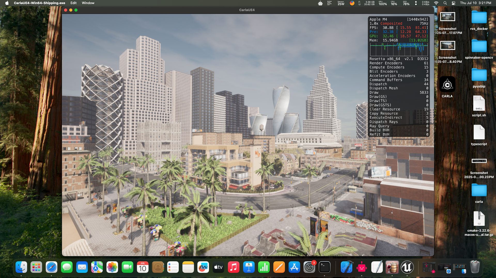

[CARLA](https://carla.org/) is an open-source simulator for autonomous driving research. It is designed to be run on Windows and Linux with Nvidia GPUs with no native support for MacOS. With the new Apple Silicon Macs (M-series) becoming more capable in terms of raw power and community support, many researchers (including me) have chosen Macs over Nvidia workstations for their RAM to price ratio. As I am interested in self-driving cars, I wanted to setup CARLA on my Mac. But, after many failed attempts, my dear friend, a mac gamer had got it working. This blog is a guide to run CARLA on M-series Macs.


This has been tested on:
1. **MacBook M1 Pro, 16gb:** v0.9.11, v0.9.12, v0.9.13, v0.9.14 worked, v0.9.15+ failed to render graphics.
2. **Mac Mini M4, 24gb:** v0.9.11 to v0.9.15 worked with 30-60fps, v0.10.0 ran at 10-15fps


## Prerequisites

1. Ensure MacOS is 15.5+, older versions might not support some versions of Carla. (v0.9.12 to v0.9.15 failed in Sequoia 15.2, while v0.9.11 and v0.10.0 ran without any problems)
2. 16 gigs of RAM is recommended to run Carla v0.9.10+
3. 24 gigs of RAM for Carla v0.9.15+ and v0.10.0
4. Older chips(M1, M2) may not be powerful enough to handle newer versions of Carla(v0.9.15+)

## Setup

1. Install [Winery](https://github.com/Kegworks-App/Winery/releases) (now Sikarugir).
2. Open Winery and install the latest engine and update the wrapper.
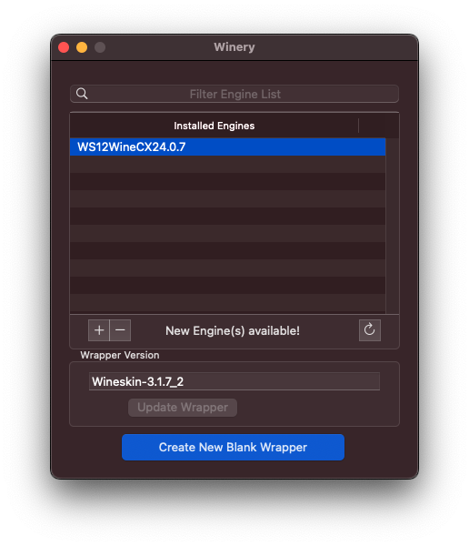
3. Then create a new blank wrapper.
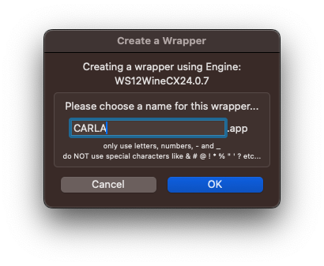
4. Open `CARLA.app` in finder and right-click on it to open `package contents`.
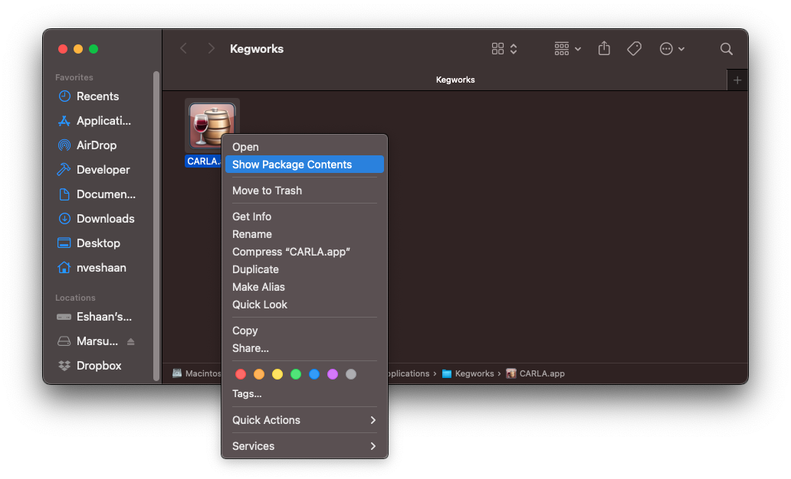
5. Navigate to `Contents/` and open `KegworksConfig.app`.
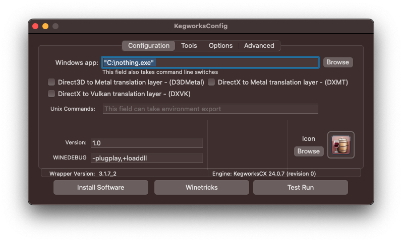
6. Open `Winetricks`, search for `vcrun` and click `Run` after selecting `vcrun2019`, `vcrun2022`. This will install the required Visual Studio packages.
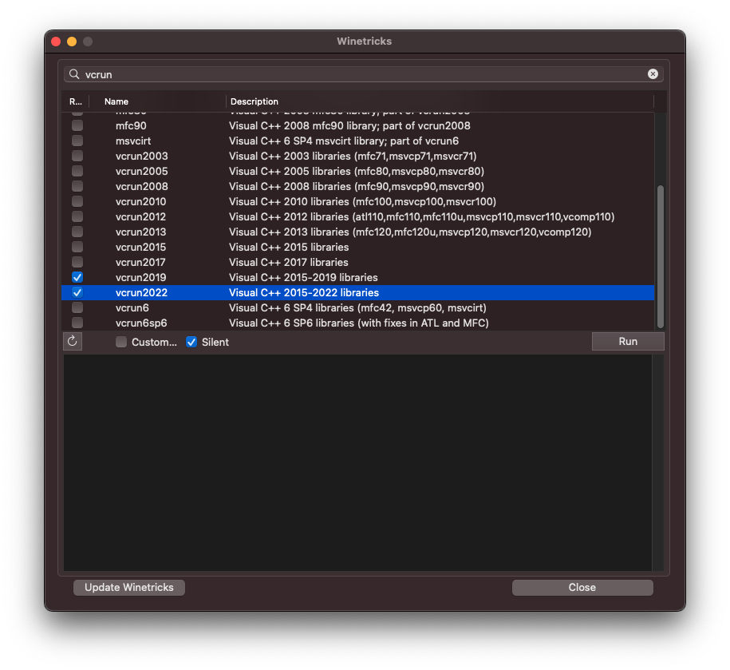
7. After its done, you can close `Winetricks`.

## Installation

1. Download the Windows shipment of Carla with version of your choice from its [release](https://github.com/carla-simulator/carla/releases) page, and extract the folder.
2. In the `KeyworksConfig.app`, click on `Install Software`.
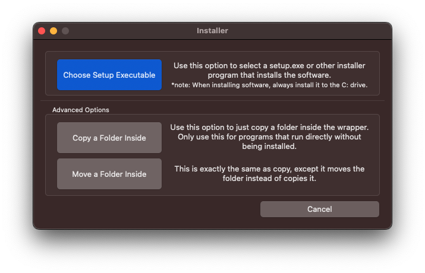
3. Click `Move a Folder Inside`, and select the folder you've just extracted.
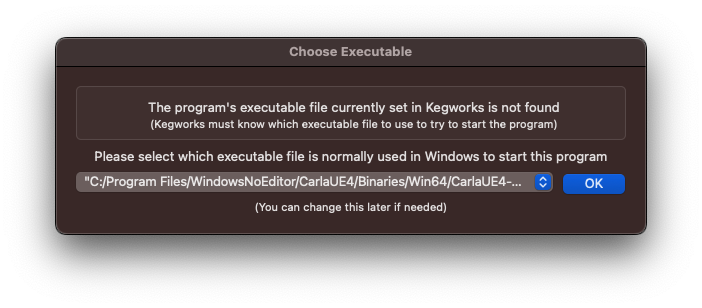
4. Change the executable file to `C:/Program Files/WindowsNoEditor/CarlaUE4.exe` and click `OK`.

## Usage

1. Check the `D3DMetal` option and click on `Test Run` to see if Carla is working as expected.
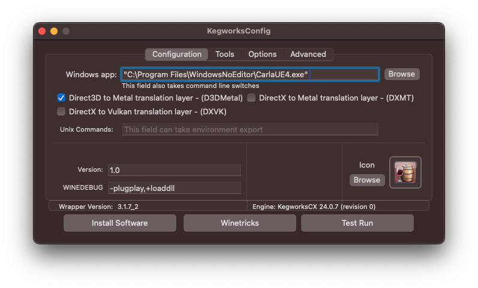
2. After the test run, you can close the `KegworksConfig.app` and launch Carla from `CARLA.app` like a regular Mac application.
3. You can add flags like `-RenderOffScreen`, `--ros2`, `--port`, etc. in the `Windows app:` field.

4. You can access tools like `Task Manager`, `Command Prompt`, `Control Panel` in the `Tools` window. You can also stop your Carla app (if unexpected behavior occurs or when using -RenderOffScreen) using `Kill Wine Processes`. 
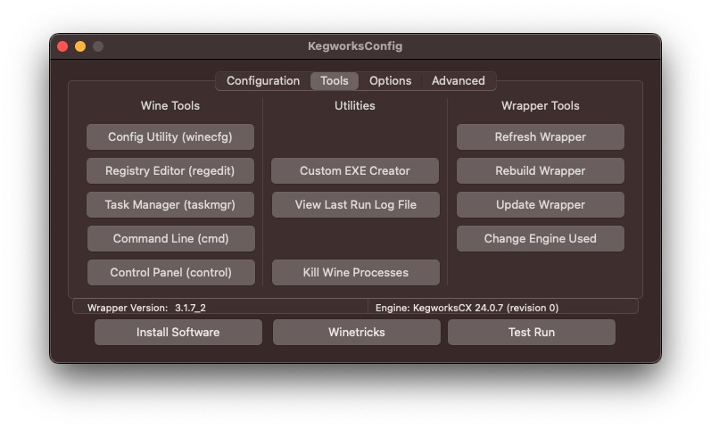
5. You can enable `FPS`, `GPU`, `Mem` info on Carla window, by checking the `Performance HUD` option.
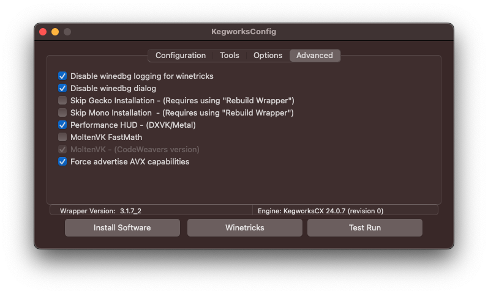

## Conclusion

To run the CARLA Python Client, check this [discussion](https://github.com/carla-simulator/carla/discussions/9037) on GitHub. This guide is outdated as of 2026, but thanks to the carla community, there are two amazing videos on the discussion page where a contributor walks you through the new steps to setup both the server and the client. The below video shows a demo of Python client in docker container.

