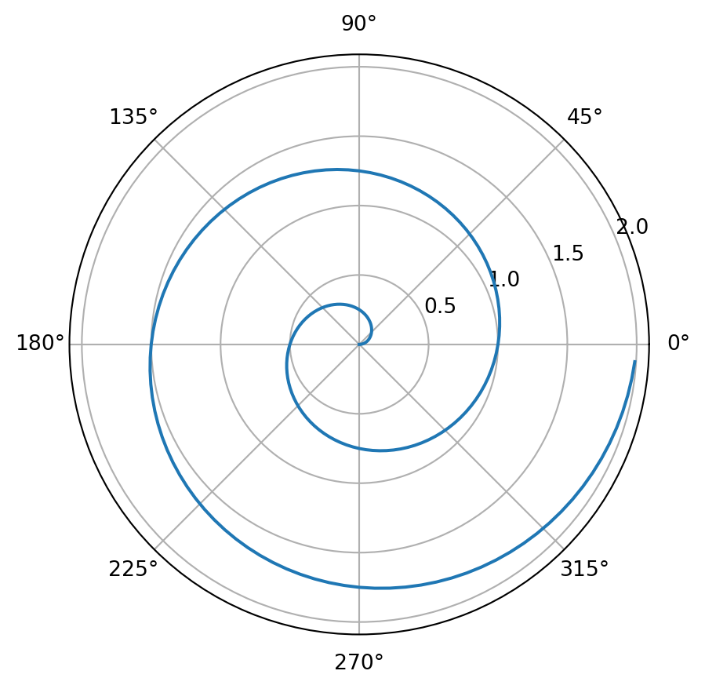

<script src="https://cdn.jsdelivr.net/npm/requirejs@2.3.6/require.min.js" integrity="sha384-c9c+LnTbwQ3aujuU7ULEPVvgLs+Fn6fJUvIGTsuu1ZcCf11fiEubah0ttpca4ntM sha384-6V1/AdqZRWk1KAlWbKBlGhN7VG4iE/yAZcO6NZPMF8od0vukrvr0tg4qY6NSrItx" crossorigin="anonymous"></script>
<script src="https://cdn.jsdelivr.net/npm/jquery@3.5.1/dist/jquery.min.js" integrity="sha384-ZvpUoO/+PpLXR1lu4jmpXWu80pZlYUAfxl5NsBMWOEPSjUn/6Z/hRTt8+pR6L4N2" crossorigin="anonymous" data-relocate-top="true"></script>
<script type="application/javascript">define('jquery', [],function() {return window.jQuery;})</script>
<script>
window.PlotlyConfig = {MathJaxConfig: 'local'};
if (window.MathJax && window.MathJax.Hub && window.MathJax.Hub.Config) {window.MathJax.Hub.Config({SVG: {font: "STIX-Web"}});}
</script>
<script type="module">import "https://cdn.plot.ly/plotly-3.5.0.min"</script>


## Polar Axis

For a demonstration of a line plot on a polar axis, see <a href="#fig-polar" class="quarto-xref">Figure 1</a>.

``` python
import numpy as np
import matplotlib.pyplot as plt

r = np.arange(0, 2, 0.01)
theta = 2 * np.pi * r
fig, ax = plt.subplots(subplot_kw={'projection': 'polar'})
ax.plot(theta, r)
ax.set_rticks([0.5, 1, 1.5, 2])
ax.grid(True)
plt.show()
```



``` python
import plotly.io as pio
import plotly.express as px
df = px.data.iris()
fig = px.scatter(df, x="sepal_width", y="sepal_length", 
                 color="species", 
                 marginal_y="violin", marginal_x="box", 
                 trendline="ols", template="simple_white")
fig.show()
```

<div>            <script src="https://cdnjs.cloudflare.com/ajax/libs/mathjax/2.7.5/MathJax.js?config=TeX-AMS-MML_SVG"></script><script>if (window.MathJax && window.MathJax.Hub && window.MathJax.Hub.Config) {window.MathJax.Hub.Config({SVG: {font: "STIX-Web"}});}</script>                <script>window.PlotlyConfig = {MathJaxConfig: 'local'};</script>
        <script charset="utf-8" src="https://cdn.plot.ly/plotly-3.5.0.min.js" integrity="sha256-fHbNLP+GlIXN+efbQec78UkemUz3NJp7UmfGxC1tNxs=" crossorigin="anonymous"></script>                <div id="5e0139fe-7fde-4b38-a69f-13099a1e3bc6" class="plotly-graph-div" style="height:525px; width:100%;"></div>            <script>                window.PLOTLYENV=window.PLOTLYENV || {};                                if (document.getElementById("5e0139fe-7fde-4b38-a69f-13099a1e3bc6")) {                    Plotly.newPlot(                        "5e0139fe-7fde-4b38-a69f-13099a1e3bc6",                        [{"hovertemplate":"species=setosa\u003cbr\u003esepal_width=%{x}\u003cbr\u003esepal_length=%{y}\u003cextra\u003e\u003c\u002fextra\u003e","legendgroup":"setosa","marker":{"color":"#1F77B4","symbol":"circle"},"mode":"markers","name":"setosa","orientation":"v","showlegend":true,"x":{"dtype":"f8","bdata":"AAAAAAAADEAAAAAAAAAIQJqZmZmZmQlAzczMzMzMCEDNzMzMzMwMQDMzMzMzMw9AMzMzMzMzC0AzMzMzMzMLQDMzMzMzMwdAzczMzMzMCECamZmZmZkNQDMzMzMzMwtAAAAAAAAACEAAAAAAAAAIQAAAAAAAABBAmpmZmZmZEUAzMzMzMzMPQAAAAAAAAAxAZmZmZmZmDkBmZmZmZmYOQDMzMzMzMwtAmpmZmZmZDUDNzMzMzMwMQGZmZmZmZgpAMzMzMzMzC0AAAAAAAAAIQDMzMzMzMwtAAAAAAAAADEAzMzMzMzMLQJqZmZmZmQlAzczMzMzMCEAzMzMzMzMLQGZmZmZmZhBAzczMzMzMEEDNzMzMzMwIQJqZmZmZmQlAAAAAAAAADEDNzMzMzMwIQAAAAAAAAAhAMzMzMzMzC0AAAAAAAAAMQGZmZmZmZgJAmpmZmZmZCUAAAAAAAAAMQGZmZmZmZg5AAAAAAAAACEBmZmZmZmYOQJqZmZmZmQlAmpmZmZmZDUBmZmZmZmYKQA=="},"xaxis":"x","y":{"dtype":"f8","bdata":"ZmZmZmZmFECamZmZmZkTQM3MzMzMzBJAZmZmZmZmEkAAAAAAAAAUQJqZmZmZmRVAZmZmZmZmEkAAAAAAAAAUQJqZmZmZmRFAmpmZmZmZE0CamZmZmZkVQDMzMzMzMxNAMzMzMzMzE0AzMzMzMzMRQDMzMzMzMxdAzczMzMzMFkCamZmZmZkVQGZmZmZmZhRAzczMzMzMFkBmZmZmZmYUQJqZmZmZmRVAZmZmZmZmFEBmZmZmZmYSQGZmZmZmZhRAMzMzMzMzE0AAAAAAAAAUQAAAAAAAABRAzczMzMzMFEDNzMzMzMwUQM3MzMzMzBJAMzMzMzMzE0CamZmZmZkVQM3MzMzMzBRAAAAAAAAAFkCamZmZmZkTQAAAAAAAABRAAAAAAAAAFkCamZmZmZkTQJqZmZmZmRFAZmZmZmZmFEAAAAAAAAAUQAAAAAAAABJAmpmZmZmZEUAAAAAAAAAUQGZmZmZmZhRAMzMzMzMzE0BmZmZmZmYUQGZmZmZmZhJAMzMzMzMzFUAAAAAAAAAUQA=="},"yaxis":"y","type":"scatter"},{"alignmentgroup":"True","hovertemplate":"species=setosa\u003cbr\u003esepal_width=%{x}\u003cextra\u003e\u003c\u002fextra\u003e","legendgroup":"setosa","marker":{"color":"#1F77B4","symbol":"circle"},"name":"setosa","notched":true,"offsetgroup":"setosa","showlegend":false,"x":{"dtype":"f8","bdata":"AAAAAAAADEAAAAAAAAAIQJqZmZmZmQlAzczMzMzMCEDNzMzMzMwMQDMzMzMzMw9AMzMzMzMzC0AzMzMzMzMLQDMzMzMzMwdAzczMzMzMCECamZmZmZkNQDMzMzMzMwtAAAAAAAAACEAAAAAAAAAIQAAAAAAAABBAmpmZmZmZEUAzMzMzMzMPQAAAAAAAAAxAZmZmZmZmDkBmZmZmZmYOQDMzMzMzMwtAmpmZmZmZDUDNzMzMzMwMQGZmZmZmZgpAMzMzMzMzC0AAAAAAAAAIQDMzMzMzMwtAAAAAAAAADEAzMzMzMzMLQJqZmZmZmQlAzczMzMzMCEAzMzMzMzMLQGZmZmZmZhBAzczMzMzMEEDNzMzMzMwIQJqZmZmZmQlAAAAAAAAADEDNzMzMzMwIQAAAAAAAAAhAMzMzMzMzC0AAAAAAAAAMQGZmZmZmZgJAmpmZmZmZCUAAAAAAAAAMQGZmZmZmZg5AAAAAAAAACEBmZmZmZmYOQJqZmZmZmQlAmpmZmZmZDUBmZmZmZmYKQA=="},"xaxis":"x3","yaxis":"y3","type":"box"},{"alignmentgroup":"True","hovertemplate":"species=setosa\u003cbr\u003esepal_length=%{y}\u003cextra\u003e\u003c\u002fextra\u003e","legendgroup":"setosa","marker":{"color":"#1F77B4","symbol":"circle"},"name":"setosa","offsetgroup":"setosa","scalegroup":"y","showlegend":false,"xaxis":"x2","y":{"dtype":"f8","bdata":"ZmZmZmZmFECamZmZmZkTQM3MzMzMzBJAZmZmZmZmEkAAAAAAAAAUQJqZmZmZmRVAZmZmZmZmEkAAAAAAAAAUQJqZmZmZmRFAmpmZmZmZE0CamZmZmZkVQDMzMzMzMxNAMzMzMzMzE0AzMzMzMzMRQDMzMzMzMxdAzczMzMzMFkCamZmZmZkVQGZmZmZmZhRAzczMzMzMFkBmZmZmZmYUQJqZmZmZmRVAZmZmZmZmFEBmZmZmZmYSQGZmZmZmZhRAMzMzMzMzE0AAAAAAAAAUQAAAAAAAABRAzczMzMzMFEDNzMzMzMwUQM3MzMzMzBJAMzMzMzMzE0CamZmZmZkVQM3MzMzMzBRAAAAAAAAAFkCamZmZmZkTQAAAAAAAABRAAAAAAAAAFkCamZmZmZkTQJqZmZmZmRFAZmZmZmZmFEAAAAAAAAAUQAAAAAAAABJAmpmZmZmZEUAAAAAAAAAUQGZmZmZmZhRAMzMzMzMzE0BmZmZmZmYUQGZmZmZmZhJAMzMzMzMzFUAAAAAAAAAUQA=="},"yaxis":"y2","type":"violin"},{"hovertemplate":"\u003cb\u003eOLS trendline\u003c\u002fb\u003e\u003cbr\u003esepal_length = 0.690854 * sepal_width + 2.64466\u003cbr\u003eR\u003csup\u003e2\u003c\u002fsup\u003e=0.557681\u003cbr\u003e\u003cbr\u003especies=setosa\u003cbr\u003esepal_width=%{x}\u003cbr\u003esepal_length=%{y} \u003cb\u003e(trend)\u003c\u002fb\u003e\u003cextra\u003e\u003c\u002fextra\u003e","legendgroup":"setosa","marker":{"color":"#1F77B4","symbol":"circle"},"mode":"lines","name":"setosa","showlegend":false,"x":{"dtype":"f8","bdata":"ZmZmZmZmAkAzMzMzMzMHQAAAAAAAAAhAAAAAAAAACEAAAAAAAAAIQAAAAAAAAAhAAAAAAAAACEAAAAAAAAAIQM3MzMzMzAhAzczMzMzMCEDNzMzMzMwIQM3MzMzMzAhAzczMzMzMCECamZmZmZkJQJqZmZmZmQlAmpmZmZmZCUCamZmZmZkJQJqZmZmZmQlAZmZmZmZmCkBmZmZmZmYKQDMzMzMzMwtAMzMzMzMzC0AzMzMzMzMLQDMzMzMzMwtAMzMzMzMzC0AzMzMzMzMLQDMzMzMzMwtAMzMzMzMzC0AzMzMzMzMLQAAAAAAAAAxAAAAAAAAADEAAAAAAAAAMQAAAAAAAAAxAAAAAAAAADEAAAAAAAAAMQM3MzMzMzAxAzczMzMzMDECamZmZmZkNQJqZmZmZmQ1AmpmZmZmZDUBmZmZmZmYOQGZmZmZmZg5AZmZmZmZmDkBmZmZmZmYOQDMzMzMzMw9AMzMzMzMzD0AAAAAAAAAQQGZmZmZmZhBAzczMzMzMEECamZmZmZkRQA=="},"xaxis":"x","y":{"dtype":"f8","bdata":"Vjr3VTvvEEBrBy1WsZcSQERUi6tv3hJARFSLq2\u002feEkBEVIurb94SQERUi6tv3hJARFSLq2\u002feEkBEVIurb94SQB2h6QAuJRNAHaHpAC4lE0AdoekALiUTQB2h6QAuJRNAHaHpAC4lE0D27UdW7GsTQPbtR1bsaxNA9u1HVuxrE0D27UdW7GsTQPbtR1bsaxNAzjqmq6qyE0DOOqarqrITQKiHBAFp+RNAqIcEAWn5E0CohwQBafkTQKiHBAFp+RNAqIcEAWn5E0CohwQBafkTQKiHBAFp+RNAqIcEAWn5E0CohwQBafkTQIDUYlYnQBRAgNRiVidAFECA1GJWJ0AUQIDUYlYnQBRAgNRiVidAFECA1GJWJ0AUQFkhwavlhhRAWSHBq+WGFEAybh8BpM0UQDJuHwGkzRRAMm4fAaTNFEAKu31WYhQVQAq7fVZiFBVACrt9VmIUFUAKu31WYhQVQOQH3KsgWxVA5AfcqyBbFUC8VDoB36EVQJWhmFad6BVAbu72q1svFkAgiLNW2LwWQA=="},"yaxis":"y","type":"scatter"},{"hovertemplate":"species=versicolor\u003cbr\u003esepal_width=%{x}\u003cbr\u003esepal_length=%{y}\u003cextra\u003e\u003c\u002fextra\u003e","legendgroup":"versicolor","marker":{"color":"#FF7F0E","symbol":"circle"},"mode":"markers","name":"versicolor","orientation":"v","showlegend":true,"x":{"dtype":"f8","bdata":"mpmZmZmZCUCamZmZmZkJQM3MzMzMzAhAZmZmZmZmAkBmZmZmZmYGQGZmZmZmZgZAZmZmZmZmCkAzMzMzMzMDQDMzMzMzMwdAmpmZmZmZBUAAAAAAAAAAQAAAAAAAAAhAmpmZmZmZAUAzMzMzMzMHQDMzMzMzMwdAzczMzMzMCEAAAAAAAAAIQJqZmZmZmQVAmpmZmZmZAUAAAAAAAAAEQJqZmZmZmQlAZmZmZmZmBkAAAAAAAAAEQGZmZmZmZgZAMzMzMzMzB0AAAAAAAAAIQGZmZmZmZgZAAAAAAAAACEAzMzMzMzMHQM3MzMzMzARAMzMzMzMzA0AzMzMzMzMDQJqZmZmZmQVAmpmZmZmZBUAAAAAAAAAIQDMzMzMzMwtAzczMzMzMCEBmZmZmZmYCQAAAAAAAAAhAAAAAAAAABEDNzMzMzMwEQAAAAAAAAAhAzczMzMzMBEBmZmZmZmYCQJqZmZmZmQVAAAAAAAAACEAzMzMzMzMHQDMzMzMzMwdAAAAAAAAABEBmZmZmZmYGQA=="},"xaxis":"x","y":{"dtype":"f8","bdata":"AAAAAAAAHECamZmZmZkZQJqZmZmZmRtAAAAAAAAAFkAAAAAAAAAaQM3MzMzMzBZAMzMzMzMzGUCamZmZmZkTQGZmZmZmZhpAzczMzMzMFEAAAAAAAAAUQJqZmZmZmRdAAAAAAAAAGEBmZmZmZmYYQGZmZmZmZhZAzczMzMzMGkBmZmZmZmYWQDMzMzMzMxdAzczMzMzMGEBmZmZmZmYWQJqZmZmZmRdAZmZmZmZmGEAzMzMzMzMZQGZmZmZmZhhAmpmZmZmZGUBmZmZmZmYaQDMzMzMzMxtAzczMzMzMGkAAAAAAAAAYQM3MzMzMzBZAAAAAAAAAFkAAAAAAAAAWQDMzMzMzMxdAAAAAAAAAGECamZmZmZkVQAAAAAAAABhAzczMzMzMGkAzMzMzMzMZQGZmZmZmZhZAAAAAAAAAFkAAAAAAAAAWQGZmZmZmZhhAMzMzMzMzF0AAAAAAAAAUQGZmZmZmZhZAzczMzMzMFkDNzMzMzMwWQM3MzMzMzBhAZmZmZmZmFEDNzMzMzMwWQA=="},"yaxis":"y","type":"scatter"},{"alignmentgroup":"True","hovertemplate":"species=versicolor\u003cbr\u003esepal_width=%{x}\u003cextra\u003e\u003c\u002fextra\u003e","legendgroup":"versicolor","marker":{"color":"#FF7F0E","symbol":"circle"},"name":"versicolor","notched":true,"offsetgroup":"versicolor","showlegend":false,"x":{"dtype":"f8","bdata":"mpmZmZmZCUCamZmZmZkJQM3MzMzMzAhAZmZmZmZmAkBmZmZmZmYGQGZmZmZmZgZAZmZmZmZmCkAzMzMzMzMDQDMzMzMzMwdAmpmZmZmZBUAAAAAAAAAAQAAAAAAAAAhAmpmZmZmZAUAzMzMzMzMHQDMzMzMzMwdAzczMzMzMCEAAAAAAAAAIQJqZmZmZmQVAmpmZmZmZAUAAAAAAAAAEQJqZmZmZmQlAZmZmZmZmBkAAAAAAAAAEQGZmZmZmZgZAMzMzMzMzB0AAAAAAAAAIQGZmZmZmZgZAAAAAAAAACEAzMzMzMzMHQM3MzMzMzARAMzMzMzMzA0AzMzMzMzMDQJqZmZmZmQVAmpmZmZmZBUAAAAAAAAAIQDMzMzMzMwtAzczMzMzMCEBmZmZmZmYCQAAAAAAAAAhAAAAAAAAABEDNzMzMzMwEQAAAAAAAAAhAzczMzMzMBEBmZmZmZmYCQJqZmZmZmQVAAAAAAAAACEAzMzMzMzMHQDMzMzMzMwdAAAAAAAAABEBmZmZmZmYGQA=="},"xaxis":"x3","yaxis":"y3","type":"box"},{"alignmentgroup":"True","hovertemplate":"species=versicolor\u003cbr\u003esepal_length=%{y}\u003cextra\u003e\u003c\u002fextra\u003e","legendgroup":"versicolor","marker":{"color":"#FF7F0E","symbol":"circle"},"name":"versicolor","offsetgroup":"versicolor","scalegroup":"y","showlegend":false,"xaxis":"x2","y":{"dtype":"f8","bdata":"AAAAAAAAHECamZmZmZkZQJqZmZmZmRtAAAAAAAAAFkAAAAAAAAAaQM3MzMzMzBZAMzMzMzMzGUCamZmZmZkTQGZmZmZmZhpAzczMzMzMFEAAAAAAAAAUQJqZmZmZmRdAAAAAAAAAGEBmZmZmZmYYQGZmZmZmZhZAzczMzMzMGkBmZmZmZmYWQDMzMzMzMxdAzczMzMzMGEBmZmZmZmYWQJqZmZmZmRdAZmZmZmZmGEAzMzMzMzMZQGZmZmZmZhhAmpmZmZmZGUBmZmZmZmYaQDMzMzMzMxtAzczMzMzMGkAAAAAAAAAYQM3MzMzMzBZAAAAAAAAAFkAAAAAAAAAWQDMzMzMzMxdAAAAAAAAAGECamZmZmZkVQAAAAAAAABhAzczMzMzMGkAzMzMzMzMZQGZmZmZmZhZAAAAAAAAAFkAAAAAAAAAWQGZmZmZmZhhAMzMzMzMzF0AAAAAAAAAUQGZmZmZmZhZAzczMzMzMFkDNzMzMzMwWQM3MzMzMzBhAZmZmZmZmFEDNzMzMzMwWQA=="},"yaxis":"y2","type":"violin"},{"hovertemplate":"\u003cb\u003eOLS trendline\u003c\u002fb\u003e\u003cbr\u003esepal_length = 0.865078 * sepal_width + 3.53973\u003cbr\u003eR\u003csup\u003e2\u003c\u002fsup\u003e=0.276582\u003cbr\u003e\u003cbr\u003especies=versicolor\u003cbr\u003esepal_width=%{x}\u003cbr\u003esepal_length=%{y} \u003cb\u003e(trend)\u003c\u002fb\u003e\u003cextra\u003e\u003c\u002fextra\u003e","legendgroup":"versicolor","marker":{"color":"#FF7F0E","symbol":"circle"},"mode":"lines","name":"versicolor","showlegend":false,"x":{"dtype":"f8","bdata":"AAAAAAAAAECamZmZmZkBQJqZmZmZmQFAZmZmZmZmAkBmZmZmZmYCQGZmZmZmZgJAMzMzMzMzA0AzMzMzMzMDQDMzMzMzMwNAAAAAAAAABEAAAAAAAAAEQAAAAAAAAARAAAAAAAAABEDNzMzMzMwEQM3MzMzMzARAzczMzMzMBECamZmZmZkFQJqZmZmZmQVAmpmZmZmZBUCamZmZmZkFQJqZmZmZmQVAZmZmZmZmBkBmZmZmZmYGQGZmZmZmZgZAZmZmZmZmBkBmZmZmZmYGQGZmZmZmZgZAMzMzMzMzB0AzMzMzMzMHQDMzMzMzMwdAMzMzMzMzB0AzMzMzMzMHQDMzMzMzMwdAMzMzMzMzB0AAAAAAAAAIQAAAAAAAAAhAAAAAAAAACEAAAAAAAAAIQAAAAAAAAAhAAAAAAAAACEAAAAAAAAAIQAAAAAAAAAhAzczMzMzMCEDNzMzMzMwIQM3MzMzMzAhAmpmZmZmZCUCamZmZmZkJQJqZmZmZmQlAZmZmZmZmCkAzMzMzMzMLQA=="},"xaxis":"x","y":{"dtype":"f8","bdata":"DIS8FV4UFUBP8lkSicUVQE\u002fyWRKJxRVAcKmokB4eFkBwqaiQHh4WQHCpqJAeHhZAkmD3DrR2FkCSYPcOtHYWQJJg9w60dhZAtBdGjUnPFkC0F0aNSc8WQLQXRo1JzxZAtBdGjUnPFkDVzpQL3ycXQNXOlAvfJxdA1c6UC98nF0D2heOJdIAXQPaF44l0gBdA9oXjiXSAF0D2heOJdIAXQPaF44l0gBdAGD0yCArZF0AYPTIICtkXQBg9MggK2RdAGD0yCArZF0AYPTIICtkXQBg9MggK2RdAOvSAhp8xGEA69ICGnzEYQDr0gIafMRhAOvSAhp8xGEA69ICGnzEYQDr0gIafMRhAOvSAhp8xGEBbq88ENYoYQFurzwQ1ihhAW6vPBDWKGEBbq88ENYoYQFurzwQ1ihhAW6vPBDWKGEBbq88ENYoYQFurzwQ1ihhAfGIeg8riGEB8Yh6DyuIYQHxiHoPK4hhAnhltAWA7GUCeGW0BYDsZQJ4ZbQFgOxlAwNC7f\u002fWTGUDhhwr+iuwZQA=="},"yaxis":"y","type":"scatter"},{"hovertemplate":"species=virginica\u003cbr\u003esepal_width=%{x}\u003cbr\u003esepal_length=%{y}\u003cextra\u003e\u003c\u002fextra\u003e","legendgroup":"virginica","marker":{"color":"#2CA02C","symbol":"circle"},"mode":"markers","name":"virginica","orientation":"v","showlegend":true,"x":{"dtype":"f8","bdata":"ZmZmZmZmCkCamZmZmZkFQAAAAAAAAAhAMzMzMzMzB0AAAAAAAAAIQAAAAAAAAAhAAAAAAAAABEAzMzMzMzMHQAAAAAAAAARAzczMzMzMDECamZmZmZkJQJqZmZmZmQVAAAAAAAAACEAAAAAAAAAEQGZmZmZmZgZAmpmZmZmZCUAAAAAAAAAIQGZmZmZmZg5AzczMzMzMBECamZmZmZkBQJqZmZmZmQlAZmZmZmZmBkBmZmZmZmYGQJqZmZmZmQVAZmZmZmZmCkCamZmZmZkJQGZmZmZmZgZAAAAAAAAACEBmZmZmZmYGQAAAAAAAAAhAZmZmZmZmBkBmZmZmZmYOQGZmZmZmZgZAZmZmZmZmBkDNzMzMzMwEQAAAAAAAAAhAMzMzMzMzC0DNzMzMzMwIQAAAAAAAAAhAzczMzMzMCEDNzMzMzMwIQM3MzMzMzAhAmpmZmZmZBUCamZmZmZkJQGZmZmZmZgpAAAAAAAAACEAAAAAAAAAEQAAAAAAAAAhAMzMzMzMzC0AAAAAAAAAIQA=="},"xaxis":"x","y":{"dtype":"f8","bdata":"MzMzMzMzGUAzMzMzMzMXQGZmZmZmZhxAMzMzMzMzGUAAAAAAAAAaQGZmZmZmZh5AmpmZmZmZE0AzMzMzMzMdQM3MzMzMzBpAzczMzMzMHEAAAAAAAAAaQJqZmZmZmRlAMzMzMzMzG0DNzMzMzMwWQDMzMzMzMxdAmpmZmZmZGUAAAAAAAAAaQM3MzMzMzB5AzczMzMzMHkAAAAAAAAAYQJqZmZmZmRtAZmZmZmZmFkDNzMzMzMweQDMzMzMzMxlAzczMzMzMGkDNzMzMzMwcQM3MzMzMzBhAZmZmZmZmGECamZmZmZkZQM3MzMzMzBxAmpmZmZmZHUCamZmZmZkfQJqZmZmZmRlAMzMzMzMzGUBmZmZmZmYYQM3MzMzMzB5AMzMzMzMzGUCamZmZmZkZQAAAAAAAABhAmpmZmZmZG0DNzMzMzMwaQJqZmZmZmRtAMzMzMzMzF0AzMzMzMzMbQM3MzMzMzBpAzczMzMzMGkAzMzMzMzMZQAAAAAAAABpAzczMzMzMGECamZmZmZkXQA=="},"yaxis":"y","type":"scatter"},{"alignmentgroup":"True","hovertemplate":"species=virginica\u003cbr\u003esepal_width=%{x}\u003cextra\u003e\u003c\u002fextra\u003e","legendgroup":"virginica","marker":{"color":"#2CA02C","symbol":"circle"},"name":"virginica","notched":true,"offsetgroup":"virginica","showlegend":false,"x":{"dtype":"f8","bdata":"ZmZmZmZmCkCamZmZmZkFQAAAAAAAAAhAMzMzMzMzB0AAAAAAAAAIQAAAAAAAAAhAAAAAAAAABEAzMzMzMzMHQAAAAAAAAARAzczMzMzMDECamZmZmZkJQJqZmZmZmQVAAAAAAAAACEAAAAAAAAAEQGZmZmZmZgZAmpmZmZmZCUAAAAAAAAAIQGZmZmZmZg5AzczMzMzMBECamZmZmZkBQJqZmZmZmQlAZmZmZmZmBkBmZmZmZmYGQJqZmZmZmQVAZmZmZmZmCkCamZmZmZkJQGZmZmZmZgZAAAAAAAAACEBmZmZmZmYGQAAAAAAAAAhAZmZmZmZmBkBmZmZmZmYOQGZmZmZmZgZAZmZmZmZmBkDNzMzMzMwEQAAAAAAAAAhAMzMzMzMzC0DNzMzMzMwIQAAAAAAAAAhAzczMzMzMCEDNzMzMzMwIQM3MzMzMzAhAmpmZmZmZBUCamZmZmZkJQGZmZmZmZgpAAAAAAAAACEAAAAAAAAAEQAAAAAAAAAhAMzMzMzMzC0AAAAAAAAAIQA=="},"xaxis":"x3","yaxis":"y3","type":"box"},{"alignmentgroup":"True","hovertemplate":"species=virginica\u003cbr\u003esepal_length=%{y}\u003cextra\u003e\u003c\u002fextra\u003e","legendgroup":"virginica","marker":{"color":"#2CA02C","symbol":"circle"},"name":"virginica","offsetgroup":"virginica","scalegroup":"y","showlegend":false,"xaxis":"x2","y":{"dtype":"f8","bdata":"MzMzMzMzGUAzMzMzMzMXQGZmZmZmZhxAMzMzMzMzGUAAAAAAAAAaQGZmZmZmZh5AmpmZmZmZE0AzMzMzMzMdQM3MzMzMzBpAzczMzMzMHEAAAAAAAAAaQJqZmZmZmRlAMzMzMzMzG0DNzMzMzMwWQDMzMzMzMxdAmpmZmZmZGUAAAAAAAAAaQM3MzMzMzB5AzczMzMzMHkAAAAAAAAAYQJqZmZmZmRtAZmZmZmZmFkDNzMzMzMweQDMzMzMzMxlAzczMzMzMGkDNzMzMzMwcQM3MzMzMzBhAZmZmZmZmGECamZmZmZkZQM3MzMzMzBxAmpmZmZmZHUCamZmZmZkfQJqZmZmZmRlAMzMzMzMzGUBmZmZmZmYYQM3MzMzMzB5AMzMzMzMzGUCamZmZmZkZQAAAAAAAABhAmpmZmZmZG0DNzMzMzMwaQJqZmZmZmRtAMzMzMzMzF0AzMzMzMzMbQM3MzMzMzBpAzczMzMzMGkAzMzMzMzMZQAAAAAAAABpAzczMzMzMGECamZmZmZkXQA=="},"yaxis":"y2","type":"violin"},{"hovertemplate":"\u003cb\u003eOLS trendline\u003c\u002fb\u003e\u003cbr\u003esepal_length = 0.901534 * sepal_width + 3.90684\u003cbr\u003eR\u003csup\u003e2\u003c\u002fsup\u003e=0.209057\u003cbr\u003e\u003cbr\u003especies=virginica\u003cbr\u003esepal_width=%{x}\u003cbr\u003esepal_length=%{y} \u003cb\u003e(trend)\u003c\u002fb\u003e\u003cextra\u003e\u003c\u002fextra\u003e","legendgroup":"virginica","marker":{"color":"#2CA02C","symbol":"circle"},"mode":"lines","name":"virginica","showlegend":false,"x":{"dtype":"f8","bdata":"mpmZmZmZAUAAAAAAAAAEQAAAAAAAAARAAAAAAAAABEAAAAAAAAAEQM3MzMzMzARAzczMzMzMBECamZmZmZkFQJqZmZmZmQVAmpmZmZmZBUCamZmZmZkFQGZmZmZmZgZAZmZmZmZmBkBmZmZmZmYGQGZmZmZmZgZAZmZmZmZmBkBmZmZmZmYGQGZmZmZmZgZAZmZmZmZmBkAzMzMzMzMHQDMzMzMzMwdAAAAAAAAACEAAAAAAAAAIQAAAAAAAAAhAAAAAAAAACEAAAAAAAAAIQAAAAAAAAAhAAAAAAAAACEAAAAAAAAAIQAAAAAAAAAhAAAAAAAAACEAAAAAAAAAIQAAAAAAAAAhAzczMzMzMCEDNzMzMzMwIQM3MzMzMzAhAzczMzMzMCECamZmZmZkJQJqZmZmZmQlAmpmZmZmZCUCamZmZmZkJQJqZmZmZmQlAZmZmZmZmCkBmZmZmZmYKQGZmZmZmZgpAMzMzMzMzC0AzMzMzMzMLQM3MzMzMzAxAZmZmZmZmDkBmZmZmZmYOQA=="},"xaxis":"x","y":{"dtype":"f8","bdata":"468u0ZOPF0D25Y5fh6QYQPbljl+HpBhA9uWOX4ekGED25Y5fh6QYQFJNBI\u002fYABlAUk0Ej9gAGUCutHm+KV0ZQK60eb4pXRlArrR5vildGUCutHm+KV0ZQAoc7+16uRlAChzv7Xq5GUAKHO\u002fterkZQAoc7+16uRlAChzv7Xq5GUAKHO\u002fterkZQAoc7+16uRlAChzv7Xq5GUBmg2QdzBUaQGaDZB3MFRpAwurZTB1yGkDC6tlMHXIaQMLq2UwdchpAwurZTB1yGkDC6tlMHXIaQMLq2UwdchpAwurZTB1yGkDC6tlMHXIaQMLq2UwdchpAwurZTB1yGkDC6tlMHXIaQMLq2UwdchpAHlJPfG7OGkAeUk98bs4aQB5ST3xuzhpAHlJPfG7OGkB6ucSrvyobQHq5xKu\u002fKhtAernEq78qG0B6ucSrvyobQHq5xKu\u002fKhtA1CA62xCHG0DUIDrbEIcbQNQgOtsQhxtAMIivCmLjG0AwiK8KYuMbQOhWmmkEnBxAoCWFyKZUHUCgJYXIplQdQA=="},"yaxis":"y","type":"scatter"}],                        {"template":{"data":{"barpolar":[{"marker":{"line":{"color":"white","width":0.5},"pattern":{"fillmode":"overlay","size":10,"solidity":0.2}},"type":"barpolar"}],"bar":[{"error_x":{"color":"rgb(36,36,36)"},"error_y":{"color":"rgb(36,36,36)"},"marker":{"line":{"color":"white","width":0.5},"pattern":{"fillmode":"overlay","size":10,"solidity":0.2}},"type":"bar"}],"carpet":[{"aaxis":{"endlinecolor":"rgb(36,36,36)","gridcolor":"white","linecolor":"white","minorgridcolor":"white","startlinecolor":"rgb(36,36,36)"},"baxis":{"endlinecolor":"rgb(36,36,36)","gridcolor":"white","linecolor":"white","minorgridcolor":"white","startlinecolor":"rgb(36,36,36)"},"type":"carpet"}],"choropleth":[{"colorbar":{"outlinewidth":1,"tickcolor":"rgb(36,36,36)","ticks":"outside"},"type":"choropleth"}],"contourcarpet":[{"colorbar":{"outlinewidth":1,"tickcolor":"rgb(36,36,36)","ticks":"outside"},"type":"contourcarpet"}],"contour":[{"colorbar":{"outlinewidth":1,"tickcolor":"rgb(36,36,36)","ticks":"outside"},"colorscale":[[0.0,"#440154"],[0.1111111111111111,"#482878"],[0.2222222222222222,"#3e4989"],[0.3333333333333333,"#31688e"],[0.4444444444444444,"#26828e"],[0.5555555555555556,"#1f9e89"],[0.6666666666666666,"#35b779"],[0.7777777777777778,"#6ece58"],[0.8888888888888888,"#b5de2b"],[1.0,"#fde725"]],"type":"contour"}],"heatmap":[{"colorbar":{"outlinewidth":1,"tickcolor":"rgb(36,36,36)","ticks":"outside"},"colorscale":[[0.0,"#440154"],[0.1111111111111111,"#482878"],[0.2222222222222222,"#3e4989"],[0.3333333333333333,"#31688e"],[0.4444444444444444,"#26828e"],[0.5555555555555556,"#1f9e89"],[0.6666666666666666,"#35b779"],[0.7777777777777778,"#6ece58"],[0.8888888888888888,"#b5de2b"],[1.0,"#fde725"]],"type":"heatmap"}],"histogram2dcontour":[{"colorbar":{"outlinewidth":1,"tickcolor":"rgb(36,36,36)","ticks":"outside"},"colorscale":[[0.0,"#440154"],[0.1111111111111111,"#482878"],[0.2222222222222222,"#3e4989"],[0.3333333333333333,"#31688e"],[0.4444444444444444,"#26828e"],[0.5555555555555556,"#1f9e89"],[0.6666666666666666,"#35b779"],[0.7777777777777778,"#6ece58"],[0.8888888888888888,"#b5de2b"],[1.0,"#fde725"]],"type":"histogram2dcontour"}],"histogram2d":[{"colorbar":{"outlinewidth":1,"tickcolor":"rgb(36,36,36)","ticks":"outside"},"colorscale":[[0.0,"#440154"],[0.1111111111111111,"#482878"],[0.2222222222222222,"#3e4989"],[0.3333333333333333,"#31688e"],[0.4444444444444444,"#26828e"],[0.5555555555555556,"#1f9e89"],[0.6666666666666666,"#35b779"],[0.7777777777777778,"#6ece58"],[0.8888888888888888,"#b5de2b"],[1.0,"#fde725"]],"type":"histogram2d"}],"histogram":[{"marker":{"line":{"color":"white","width":0.6}},"type":"histogram"}],"mesh3d":[{"colorbar":{"outlinewidth":1,"tickcolor":"rgb(36,36,36)","ticks":"outside"},"type":"mesh3d"}],"parcoords":[{"line":{"colorbar":{"outlinewidth":1,"tickcolor":"rgb(36,36,36)","ticks":"outside"}},"type":"parcoords"}],"pie":[{"automargin":true,"type":"pie"}],"scatter3d":[{"line":{"colorbar":{"outlinewidth":1,"tickcolor":"rgb(36,36,36)","ticks":"outside"}},"marker":{"colorbar":{"outlinewidth":1,"tickcolor":"rgb(36,36,36)","ticks":"outside"}},"type":"scatter3d"}],"scattercarpet":[{"marker":{"colorbar":{"outlinewidth":1,"tickcolor":"rgb(36,36,36)","ticks":"outside"}},"type":"scattercarpet"}],"scattergeo":[{"marker":{"colorbar":{"outlinewidth":1,"tickcolor":"rgb(36,36,36)","ticks":"outside"}},"type":"scattergeo"}],"scattergl":[{"marker":{"colorbar":{"outlinewidth":1,"tickcolor":"rgb(36,36,36)","ticks":"outside"}},"type":"scattergl"}],"scattermapbox":[{"marker":{"colorbar":{"outlinewidth":1,"tickcolor":"rgb(36,36,36)","ticks":"outside"}},"type":"scattermapbox"}],"scattermap":[{"marker":{"colorbar":{"outlinewidth":1,"tickcolor":"rgb(36,36,36)","ticks":"outside"}},"type":"scattermap"}],"scatterpolargl":[{"marker":{"colorbar":{"outlinewidth":1,"tickcolor":"rgb(36,36,36)","ticks":"outside"}},"type":"scatterpolargl"}],"scatterpolar":[{"marker":{"colorbar":{"outlinewidth":1,"tickcolor":"rgb(36,36,36)","ticks":"outside"}},"type":"scatterpolar"}],"scatter":[{"fillpattern":{"fillmode":"overlay","size":10,"solidity":0.2},"type":"scatter"}],"scatterternary":[{"marker":{"colorbar":{"outlinewidth":1,"tickcolor":"rgb(36,36,36)","ticks":"outside"}},"type":"scatterternary"}],"surface":[{"colorbar":{"outlinewidth":1,"tickcolor":"rgb(36,36,36)","ticks":"outside"},"colorscale":[[0.0,"#440154"],[0.1111111111111111,"#482878"],[0.2222222222222222,"#3e4989"],[0.3333333333333333,"#31688e"],[0.4444444444444444,"#26828e"],[0.5555555555555556,"#1f9e89"],[0.6666666666666666,"#35b779"],[0.7777777777777778,"#6ece58"],[0.8888888888888888,"#b5de2b"],[1.0,"#fde725"]],"type":"surface"}],"table":[{"cells":{"fill":{"color":"rgb(237,237,237)"},"line":{"color":"white"}},"header":{"fill":{"color":"rgb(217,217,217)"},"line":{"color":"white"}},"type":"table"}]},"layout":{"annotationdefaults":{"arrowhead":0,"arrowwidth":1},"autotypenumbers":"strict","coloraxis":{"colorbar":{"outlinewidth":1,"tickcolor":"rgb(36,36,36)","ticks":"outside"}},"colorscale":{"diverging":[[0.0,"rgb(103,0,31)"],[0.1,"rgb(178,24,43)"],[0.2,"rgb(214,96,77)"],[0.3,"rgb(244,165,130)"],[0.4,"rgb(253,219,199)"],[0.5,"rgb(247,247,247)"],[0.6,"rgb(209,229,240)"],[0.7,"rgb(146,197,222)"],[0.8,"rgb(67,147,195)"],[0.9,"rgb(33,102,172)"],[1.0,"rgb(5,48,97)"]],"sequential":[[0.0,"#440154"],[0.1111111111111111,"#482878"],[0.2222222222222222,"#3e4989"],[0.3333333333333333,"#31688e"],[0.4444444444444444,"#26828e"],[0.5555555555555556,"#1f9e89"],[0.6666666666666666,"#35b779"],[0.7777777777777778,"#6ece58"],[0.8888888888888888,"#b5de2b"],[1.0,"#fde725"]],"sequentialminus":[[0.0,"#440154"],[0.1111111111111111,"#482878"],[0.2222222222222222,"#3e4989"],[0.3333333333333333,"#31688e"],[0.4444444444444444,"#26828e"],[0.5555555555555556,"#1f9e89"],[0.6666666666666666,"#35b779"],[0.7777777777777778,"#6ece58"],[0.8888888888888888,"#b5de2b"],[1.0,"#fde725"]]},"colorway":["#1F77B4","#FF7F0E","#2CA02C","#D62728","#9467BD","#8C564B","#E377C2","#7F7F7F","#BCBD22","#17BECF"],"font":{"color":"rgb(36,36,36)"},"geo":{"bgcolor":"white","lakecolor":"white","landcolor":"white","showlakes":true,"showland":true,"subunitcolor":"white"},"hoverlabel":{"align":"left"},"hovermode":"closest","mapbox":{"style":"light"},"margin":{"b":0,"l":0,"r":0,"t":30},"paper_bgcolor":"white","plot_bgcolor":"white","polar":{"angularaxis":{"gridcolor":"rgb(232,232,232)","linecolor":"rgb(36,36,36)","showgrid":false,"showline":true,"ticks":"outside"},"bgcolor":"white","radialaxis":{"gridcolor":"rgb(232,232,232)","linecolor":"rgb(36,36,36)","showgrid":false,"showline":true,"ticks":"outside"}},"scene":{"xaxis":{"backgroundcolor":"white","gridcolor":"rgb(232,232,232)","gridwidth":2,"linecolor":"rgb(36,36,36)","showbackground":true,"showgrid":false,"showline":true,"ticks":"outside","zeroline":false,"zerolinecolor":"rgb(36,36,36)"},"yaxis":{"backgroundcolor":"white","gridcolor":"rgb(232,232,232)","gridwidth":2,"linecolor":"rgb(36,36,36)","showbackground":true,"showgrid":false,"showline":true,"ticks":"outside","zeroline":false,"zerolinecolor":"rgb(36,36,36)"},"zaxis":{"backgroundcolor":"white","gridcolor":"rgb(232,232,232)","gridwidth":2,"linecolor":"rgb(36,36,36)","showbackground":true,"showgrid":false,"showline":true,"ticks":"outside","zeroline":false,"zerolinecolor":"rgb(36,36,36)"}},"shapedefaults":{"fillcolor":"black","line":{"width":0},"opacity":0.3},"ternary":{"aaxis":{"gridcolor":"rgb(232,232,232)","linecolor":"rgb(36,36,36)","showgrid":false,"showline":true,"ticks":"outside"},"baxis":{"gridcolor":"rgb(232,232,232)","linecolor":"rgb(36,36,36)","showgrid":false,"showline":true,"ticks":"outside"},"bgcolor":"white","caxis":{"gridcolor":"rgb(232,232,232)","linecolor":"rgb(36,36,36)","showgrid":false,"showline":true,"ticks":"outside"}},"title":{"x":0.05},"xaxis":{"automargin":true,"gridcolor":"rgb(232,232,232)","linecolor":"rgb(36,36,36)","showgrid":false,"showline":true,"ticks":"outside","title":{"standoff":15},"zeroline":false,"zerolinecolor":"rgb(36,36,36)"},"yaxis":{"automargin":true,"gridcolor":"rgb(232,232,232)","linecolor":"rgb(36,36,36)","showgrid":false,"showline":true,"ticks":"outside","title":{"standoff":15},"zeroline":false,"zerolinecolor":"rgb(36,36,36)"}}},"xaxis":{"anchor":"y","domain":[0.0,0.7363],"title":{"text":"sepal_width"}},"yaxis":{"anchor":"x","domain":[0.0,0.7326],"title":{"text":"sepal_length"}},"xaxis2":{"anchor":"y2","domain":[0.7413,1.0],"matches":"x2","showticklabels":false,"showline":false,"ticks":""},"yaxis2":{"anchor":"x2","domain":[0.0,0.7326],"matches":"y","showticklabels":false},"xaxis3":{"anchor":"y3","domain":[0.0,0.7363],"matches":"x","showticklabels":false},"yaxis3":{"anchor":"x3","domain":[0.7426,1.0],"matches":"y3","showticklabels":false,"showline":false,"ticks":""},"xaxis4":{"anchor":"y4","domain":[0.7413,1.0],"matches":"x2","showticklabels":false,"showline":false,"ticks":""},"yaxis4":{"anchor":"x4","domain":[0.7426,1.0],"matches":"y3","showticklabels":false,"showline":false,"ticks":""},"legend":{"title":{"text":"species"},"tracegroupgap":0}},                        {"responsive": true}                    ).then(function(){
                            
var gd = document.getElementById('5e0139fe-7fde-4b38-a69f-13099a1e3bc6');
var x = new MutationObserver(function (mutations, observer) {{
        var display = window.getComputedStyle(gd).display;
        if (!display || display === 'none') {{
            console.log([gd, 'removed!']);
            Plotly.purge(gd);
            observer.disconnect();
        }}
}});

// Listen for the removal of the full notebook cells
var notebookContainer = gd.closest('#notebook-container');
if (notebookContainer) {{
    x.observe(notebookContainer, {childList: true});
}}

// Listen for the clearing of the current output cell
var outputEl = gd.closest('.output');
if (outputEl) {{
    x.observe(outputEl, {childList: true});
}}

                        })                };            </script>        </div>
