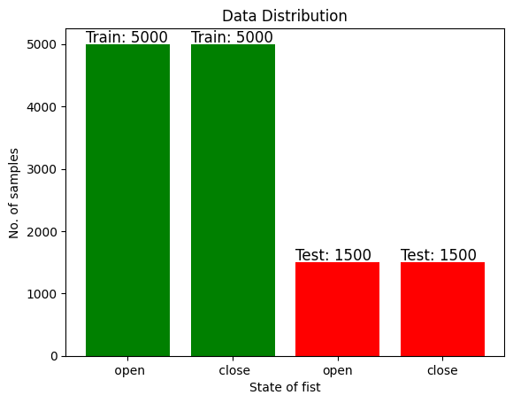

---

## Overview

Electromyography (EMG) measures the electrical activity generated by skeletal muscles during contractions, typically using surface electrodes. This technique enables the identification of specific gestures by analyzing the signals, making it particularly useful for applications in human-computer interaction. By interpreting muscle activity, devices can effectively respond to user intentions, thereby enhancing assistive technologies for individuals with mobility impairments.

To achieve high-accuracy human-computer interaction while minimizing the calibration data required from new users, a neural network is trained to classify gestures from EMG signals. This approach ensures seamless integration, allowing devices to adapt quickly to individual users and provide a more intuitive and responsive experience.

The project is divided into three main parts:

* **Data Collection**
* **Model Design and Training**
* **Real Time Interface**

## Data Acquisition

The dataset is recorded from 13 subjects. Each subject has 1000 samples, totalling to 13,000. The labels are the states of their dominant fist (open or closed). Both labels have equal number of examples. Below is the distribution of the dataset.

